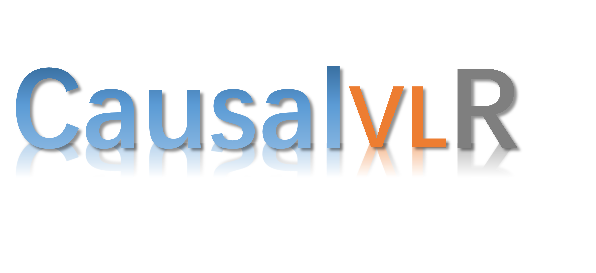
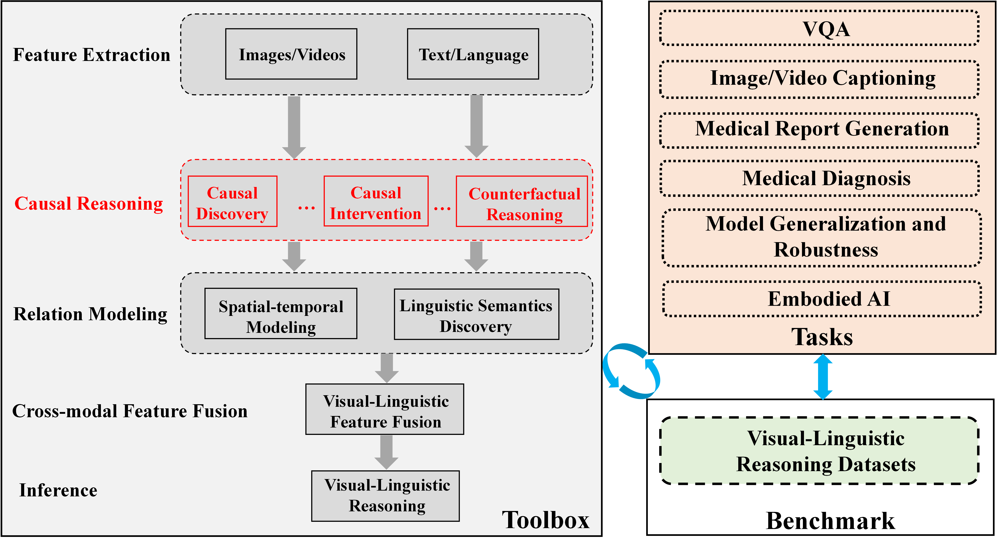
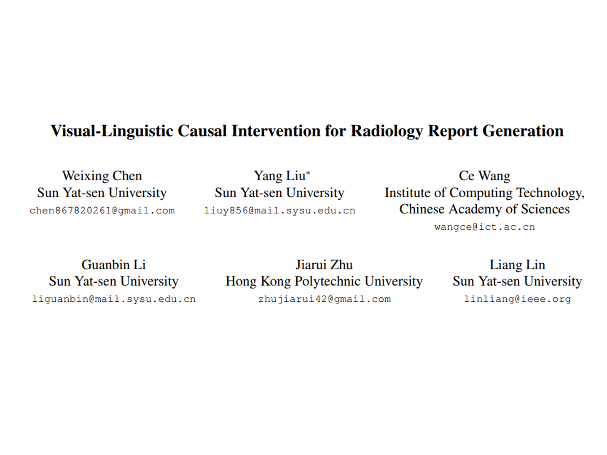

<div align="center">

<div align="center">
  <a href="https://www.sysu-hcp.net/">
    
  </a>
  <a href="">
    
  </a>
</div>

# CausalVLR

CausalVLR is a Python open-source framework for causal relation discovery and causal inference that implements most advanced causal learning algorithms for various visual-linguistic reasoning tasks, such as **Medical Report Generation**, **Video Question Answering**, and other causal reasoning tasks to be integrated.

[](https://www.python.org/downloads/)
[](https://pytorch.org/)
[](LICENSE)

[📘Documentation](docs/) |
[🛠️Installation](docs/Installation_Guide.md) |
[🚀Quick Start](docs/Quick_Start.md) |
[👀Model Zoo](#model-zoo) |
[🆕Update News](#whats-new) |
[🤔Reporting Issues](https://github.com/yourusername/CausalVLR/issues)

</div>

---

## 📄 Table of Contents

- [📚 Introduction](#introduction)
- [🚀 What&#39;s New](#whats-new)
- [👨‍🏫 Get Started](#get-started)
- [👀 Model Zoo](#model-zoo)
- [🎫 License](#license)
- [🖊️ Citation](#citation)
- [🙌 Contribution](#contribution)
- [🤝 Acknowledgement](#acknowledgement)

## 📚 Introduction

CausalVLR is a Python open-source framework based on PyTorch for causal relation discovery and causal inference that implements most advanced causal learning algorithms for various visual-linguistic reasoning tasks.

<div align="center">

</div>

<details open>
<summary><b>Major Features</b></summary>

- **Modular Design**

  We decompose the causal framework of visual-linguistic tasks into different components and one can easily construct a customized causal-reasoning framework by combining different modules.
- **Support of Multiple Tasks**

  The toolbox directly supports multiple visual-linguistic reasoning tasks such as **Medical Report Generation (MRG)**, **Video Question Answering (VQA)**, and other causal reasoning applications to be integrated.
- **Most Advanced**

  The toolbox stems from the codebase developed by cutting-edge research, implementing published methods such as CMCRL (Cross-Modal Causal Representation Learning) and CRA (Cross-modal Causal Relation Alignment), with most advanced performance.
- **Unified API**

  Provides consistent pipeline APIs for different tasks, making it easy to switch between models and datasets with minimal code changes.

❗ **Note:** The framework is actively being developed. Feedbacks (issues, suggestions, etc.) are highly encouraged.

### ✨ **CMCRL** - Cross-Modal Causal Representation Learning for Radiology Report Generation

<div align="center">

</div>

**Radiological Cross-modal Alignment and Reconstruction Enhanced (RadCARE)** with **Visual-Linguistic Causal Intervention (VLCI)** achieves state-of-the-art performance on medical report generation benchmarks.

#### Results on IU X-Ray Dataset

| Model                  | B@1             | B@2             | B@3             | B@4             | C               | R               | M               |
| :--------------------- | :-------------- | :-------------- | :-------------- | :-------------- | :-------------- | :-------------- | :-------------- |
| R2Gen                  | 0.470           | 0.304           | 0.219           | 0.165           | -               | 0.371           | 0.187           |
| CMCL                   | 0.473           | 0.305           | 0.217           | 0.162           | -               | 0.378           | 0.186           |
| PPKED                  | 0.483           | 0.315           | 0.224           | 0.168           | 0.351           | 0.376           | 0.190           |
| CA                     | 0.492           | 0.314           | 0.222           | 0.169           | -               | 0.381           | 0.193           |
| AlignTransformer       | 0.484           | 0.313           | 0.225           | 0.173           | -               | 0.379           | 0.204           |
| M2TR                   | 0.486           | 0.317           | 0.232           | 0.173           | -               | 0.390           | 0.192           |
| **CMCRL (Ours)** | **0.505** | **0.334** | **0.245** | **0.189** | **0.456** | **0.397** | **0.204** |

#### Results on MIMIC-CXR Dataset

| Model                  | B@1             | B@2             | B@3             | B@4             | C     | R     | M     | CE-P            | CE-R  | CE-F1           |
| :--------------------- | :-------------- | :-------------- | :-------------- | :-------------- | :---- | :---- | :---- | :-------------- | :---- | :-------------- |
| R2Gen                  | 0.353           | 0.218           | 0.145           | 0.103           | -     | 0.277 | 0.142 | 0.333           | 0.273 | 0.276           |
| CMCL                   | 0.334           | 0.217           | 0.140           | 0.097           | -     | 0.281 | 0.133 | -               | -     | -               |
| PPKED                  | 0.360           | 0.224           | 0.149           | 0.106           | 0.237 | 0.284 | 0.149 | -               | -     | -               |
| AlignTransformer       | 0.378           | 0.235           | 0.156           | 0.112           | -     | 0.283 | 0.158 | -               | -     | -               |
| DCL                    | -               | -               | -               | 0.109           | 0.281 | 0.284 | 0.150 | 0.471           | 0.352 | 0.373           |
| **CMCRL (Ours)** | **0.400** | **0.245** | **0.165** | **0.119** | 0.190 | 0.280 | 0.150 | **0.489** | 0.340 | **0.401** |

### ✨ **CRA** - Cross-modal Causal Relation Alignment for Video Question Grounding

<div align="center">

</div>

**Selected as CVPR 2025 Highlight!** CRA eliminates spurious cross-modal correlations and improves causal consistency between question-answering and video temporal grounding through front-door and back-door causal interventions.

#### Results on NExT-GQA Dataset

| Method               | What           | How            | When           | Where          | Why            | All            |
| :------------------- | :------------- | :------------- | :------------- | :------------- | :------------- | :------------- |
| HGA                  | 63.7           | 85.9           | 78.7           | 52.1           | 56.7           | 63.0           |
| IGV                  | 64.1           | 87.1           | 78.9           | 53.5           | 57.1           | 63.7           |
| HME                  | 64.0           | 87.6           | 79.0           | 52.3           | 57.6           | 63.8           |
| ATP                  | 65.0           | 88.6           | 81.4           | 54.5           | 58.5           | 65.0           |
| **CRA (Ours)** | **66.2** | **89.4** | **82.1** | **55.8** | **59.3** | **66.4** |

## 👨‍🏫 Get Started

Please see our [documentation](docs/) for the general introduction of CausalVLR.

### Installation

Please refer to [Installation Guide](docs/Installation_Guide.md) for detailed installation instructions.

**Quick Installation:**

```bash
# Clone repository
git clone https://github.com/yourusername/CausalVLR.git
cd CausalVLR

# Create environment and install
conda env create -f requirements.yml
conda activate causalvlr
pip install -e .
```

### Quick Start

#### Medical Report Generation

```bash
# Train VLCI model on IU X-Ray dataset
python main.py -c configs/MRG/iu_xray/vlci.json
```

```python
from causalvlr.api.pipeline.MRG import MRGPipeline
import json

# Load configuration
with open('configs/MRG/iu_xray/vlci.json', 'r') as f:
    config = json.load(f)

# Create and train pipeline
pipeline = MRGPipeline(config)
pipeline.train()

# Evaluate
results = pipeline.inference()
print(f"BLEU-4: {results['metrics']['BLEU_4']:.4f}")
```

#### Video Question Answering

```bash
# Train CRA model on NExT-GQA dataset
python main.py --config configs/VQA/CRA/CRA_NextGQA.yml
```

```python
from causalvlr.api.pipeline.VQA import CRAPipeline
import yaml

# Load configuration
with open('configs/VQA/CRA/CRA_NextGQA.yml', 'r') as f:
    config = yaml.safe_load(f)

# Create and train pipeline
pipeline = CRAPipeline(config)
pipeline.train()

# Test
results = pipeline.inference()
print(f"Accuracy: {results['accuracy']:.4f}")
```

For more details, see [Quick Start Guide](docs/Quick_Start.md).

## 👀 Model Zoo

Please feel free to let us know if you have any recommendation regarding datasets with high-quality.

| Task                      | Model        | Benchmark                                                                                     | Paper                                                  |
| ------------------------- | ------------ | --------------------------------------------------------------------------------------------- | ------------------------------------------------------ |
| Medical Report Generation | CMCRL (VLCI) | [IU X-Ray](https://openi.nlm.nih.gov/), [MIMIC-CXR](https://physionet.org/content/mimic-cxr/2.0.0/) | [TIP 2025](https://arxiv.org/pdf/2303.09117.pdf)          |
| Video Question Grounding  | CRA          | [NExT-GQA](https://github.com/doc-doc/NExT-GQA), [STAR](https://bobbywu.com/STAR/)                  | [CVPR 2025](https://arxiv.org/pdf/2503.07635) (Highlight) |
| Video Question Answering  | TempCLIP     | NExT-QA, STAR                                                                                 | -                                                      |

## 🎫 License

This project is released under the [Apache 2.0 license](LICENSE).

## 🖊️ Citation

If you find this project useful in your research, please consider cite:

```bibtex
@ARTICLE{chen2025cmcrl,
  author={Chen, Weixing and Liu, Yang and Wang, Ce and Zhu, Jiarui and Li, Guanbin and Liu, Cheng-Lin and Lin, Liang},
  journal={IEEE Transactions on Image Processing},
  title={Cross-Modal Causal Representation Learning for Radiology Report Generation},
  year={2025},
  volume={34},
  pages={2970-2985},
  doi={10.1109/TIP.2025.3568746}
}

@inproceedings{chen2025cra,
  title={Cross-modal Causal Relation Alignment for Video Question Grounding},
  author={Chen, Weixing and Liu, Yang and Chen, Binglin and Su, Jiandong and Zheng, Yongsen and Lin, Liang},
  booktitle={Proceedings of the IEEE/CVF Conference on Computer Vision and Pattern Recognition},
  year={2025}
}
```

## 🙌 Contribution

Please feel free to open an issue if you find anything unexpected. We are always targeting to make our community better!

We appreciate all the contributors who implement their methods or add new features and users who give valuable feedback.

## 🤝 Acknowledgement

CausalVLR is an open-source project that integrates cutting-edge research in causal visual-language reasoning. We wish that the toolbox and benchmark could serve the growing research community by providing a flexible toolkit to reimplement existing methods and develop new models.

### Related Projects

This toolbox integrates and builds upon the following works:

- **CMCRL**: [Cross-Modal Causal Representation Learning for Radiology Report Generation](https://arxiv.org/pdf/2303.09117.pdf)
- **CRA-GQA**: [Cross-modal Causal Relation Alignment for Video Question Grounding](https://arxiv.org/pdf/2503.07635)

We thank the authors for their excellent work and open-source contributions.
