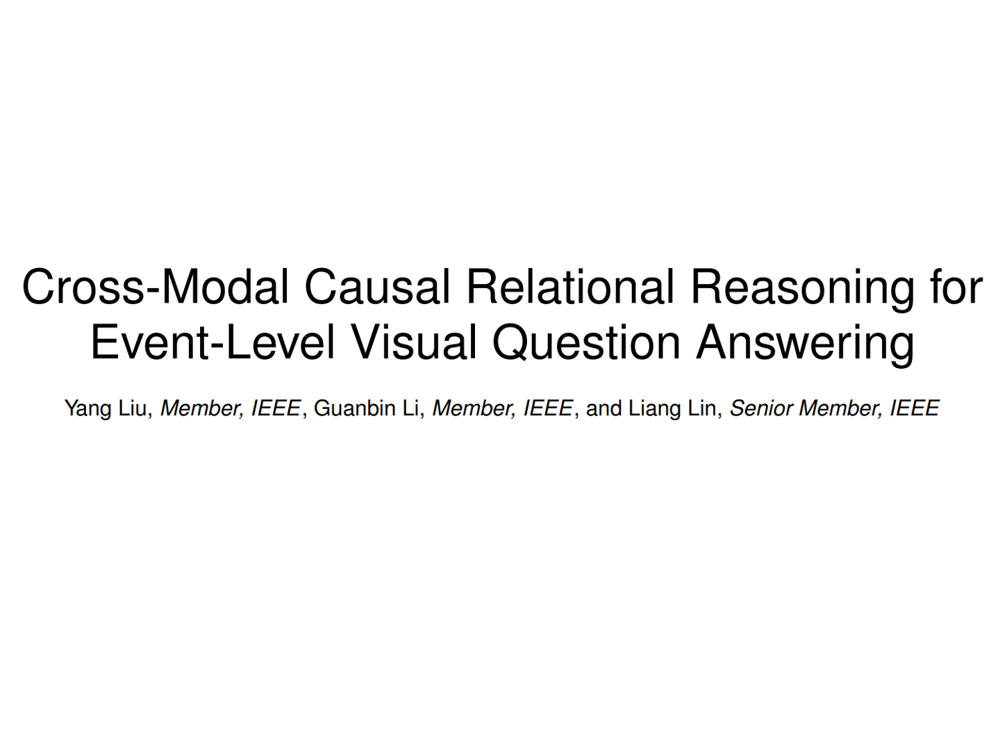

# TPAMI 2023: Cross-modal Causal Intervention for Event-level Video Question Answering

<div align=center>

   

## |[📜 paper](https://arxiv.org/pdf/2207.12647.pdf) | [🌌 code](https://github.com/YangLiu9208/CMCIR) |

</div>

---

Existing visual question answering methods often suffer from cross-modal spurious correlations and oversimplified eventlevel reasoning processes that fail to capture event temporality, causality, and dynamics spanning over the video. In this work, to address the task of event-level visual question answering, we propose a framework for cross-modal causal relational reasoning. In particular, a set of causal intervention operations is introduced to discover the underlying causal structures across visual and linguistic modalities. Our framework, named Cross-Modal Causal RelatIonal Reasoning (CMCIR), involves three modules: i) Causality-aware Visual-Linguistic Reasoning (CVLR) module for collaboratively disentangling the visual and linguistic spurious correlations via front-door and backdoor causal interventions; ii) Spatial-Temporal Transformer (STT) module for capturing the fine-grained interactions between visual and linguistic semantics; iii) Visual-Linguistic Feature Fusion (VLFF) module for learning the global semantic-aware visual-linguistic representations adaptively. Extensive experiments on four event-level datasets demonstrate the superiority of our CMCIR in discovering visual-linguistic causal structures and achieving robust event-level visual question answering

## Benchmarks: 
[SUTD-TrafficQA](https://sutdcv.github.io/SUTD-TrafficQA/#/), [TGIF-QA](https://github.com/YunseokJANG/tgif-qa), [MSVD-QA](https://github.com/xudejing/video-question-answering) and [MSRVTT-QA](https://github.com/xudejing/video-question-answering) datasets.      

## Citation
```
@article{CMCIR,
  title={Cross-Modal Causal Relational Reasoning for Event-Level Visual Question Answering},
  author={Liu, Yang and Li, Guanbin and Lin, Liang},
  journal={IEEE Transactions on Pattern Analysis and Machine Intelligence},
  year={2023}
  doi={10.1109/TPAMI.2023.3284038}
}

@article{liu2022cross,
  title={Cross-modal causal relational reasoning for event-level visual question answering},
  author={Liu, Yang and Li, Guanbin and Lin, Liang},
  journal={arXiv preprint arXiv:2207.12647},
  year={2022}
}
```