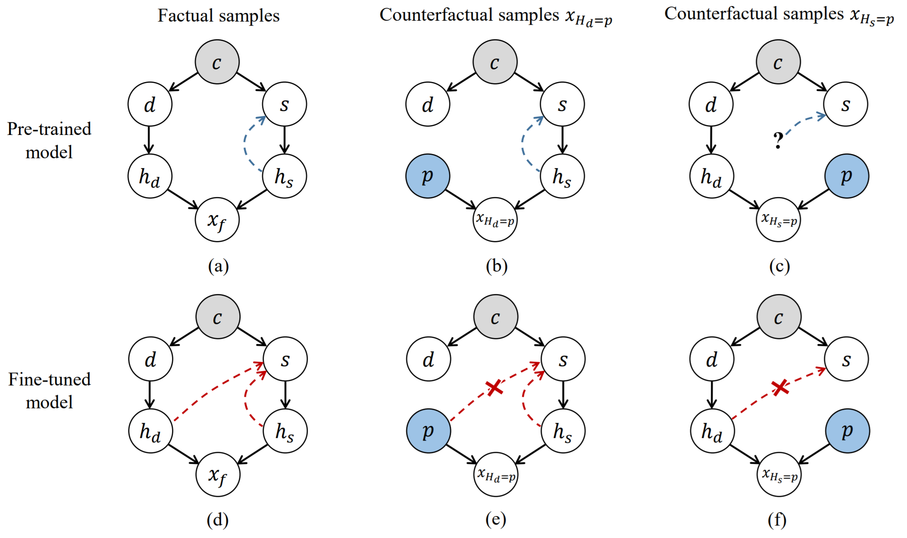

# CVPR 2023: Masked Images Are Counterfactual Samples for Robust Fine-tuning


<div align=center>

          

## |[📜 paper](https://openaccess.thecvf.com/content/CVPR2023/papers/Xiao_Masked_Images_Are_Counterfactual_Samples_for_Robust_Fine-Tuning_CVPR_2023_paper.pdf) | [🌌 code](https://github.com/Coxy7/robust-finetuning) |

</div>

## Citation    
```
@inproceedings{xiao2023masked,
  title={Masked Images Are Counterfactual Samples for Robust Fine-tuning},
  author={Xiao, Yao and Tang, Ziyi and Wei, Pengxu and Liu, Cong and Lin, Liang},
  booktitle={Proceedings of the IEEE/CVF Conference on Computer Vision and Pattern Recognition},
  pages={20301--20310},
  year={2023}
}